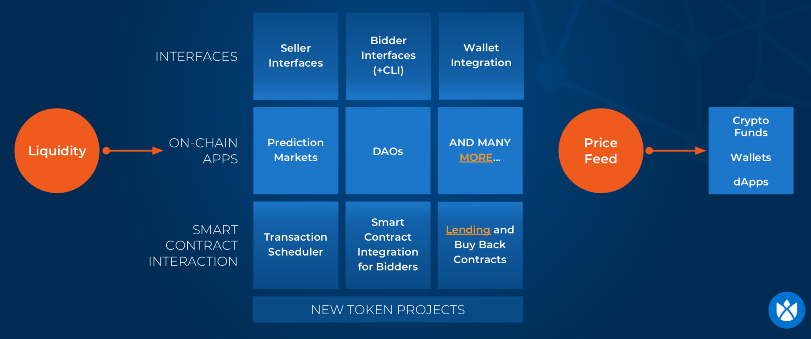

# Interfaces

### DutchX as an open protocol
The DutchX is **100% open source** and has been built as a community effort to improve
the problems that current centralized and decentralized platforms face.

The DutchX is an ecosystem of interfaces, on chain apps, and smart contracts that
create a common liquidity pool that all users can benefit from.

## Available interfaces

Interacting with the blockchain directly (or via the command line interface), users/traders are technically enabled to trade any pair that is listed on the DutchX protocol. 

For users not quite as tech-savvy to interact with the blockchain directly, there are at least two graphical user interfaces built on top of the protocol by two independent and separate teams. These interfaces (platforms) allow direct interaction with the DutchX protocol - one single global liquidity pool, which these interfaces access.

The two graphical user interfaces are in nature very different as one allows participation as a seller in an auction and the other allows participation as a bidder in an auction. Both interfaces are mainly provided in a centralized manner (however, the teams are planning both to publish on IPFS/ENS).  
 
The two graphical user interfaces are an ideal gateway for users to generate Magnolia: users need a compatible wallet (like Metamask or the Gnosis Safe for example) with some ETH or any traded ERC20 token to start trading.

## Seller interface
The slow.trade team has a Mainnet interface available at [slow.trade](https://slow.trade/#/). A rinkeby version - to test - is available at [slow.trade/rinkeby](https://slow.trade/rinkeby/). 
On slow.trade, the user is facilitated to take part as a seller, i.e. to deposit a token into an auction. The interface is extremely simple and a user can already take part by depositing at any point in time - the deposit gets automatically put into the next running auction. Slow.trade is - on purpose - kept simple, with little additional information. 
It is recommended for users that do not have a price perception: no strategy is needed to take part!  
Slow.trade is additionally useful for any user as it displays the Magnolia balance attached to a user’s address (which cannot be seen in the wallet as it is locked in a separate contract).  
*The team decides on which tokens to list on their interface (which may be only a subset of those tradable (of which only some might be whitelisted))*.

## Bidder interface
The bidder interface is available at [fairdex.net](https://fairdex.net/) *(note: likely available from 11 February onwards)*. Switch between Mainnet and Rinkeby with your wallet provider. This interface reflects more relevant data for bidders in particular:  
Participating as a bidder requires more active participation (though made super simple via this interface). For one, bidders need to be active in moment of time that the price reflects their willingness to pay.  
In fact, this is the best strategy for participation: participation at a higher price, the bidder is at risk to overpay and participation below, the bidder is at risk to not be able to take part in the auction. This is the ideal strategy due to the fact that in the end - at auction closing - all bidders pay the same final (lowest) price! Rather than getting anything back, the bidder obtains more of the token that he/she purchased. This in turn means: upon participation, the bidder knows the minimum amount that he/she will receive.  
On top of this, actually, the user can claim already this amount (and then any additional amounts and the remainder also upon closing of the auction). Hence, a bidder has instant liquidity, where this is important.  
In summary: the bidders need to have a defined willingness to pay!  
*The team decides on which tokens to list on their interface (which may be only a subset of those tradable (of which only some might be whitelisted))*.

## Command line interface (CLI)
For more tech-savvy users of the DutchX protocol, instructions to using the command line interface are available [here](https://dutchx.readthedocs.io/en/latest/cli.html).  
*The command line interface is token-agnostic.*  

## Application programming interface (API)
Check out the API [here](https://dutchx.readthedocs.io/en/latest/api.html), available for both mainnet and rinkeby.
This is a read-only (REST) version and returns a number of auction details. It is directly linked to the blockchain (other than token symbol, which shouldn’t be used for query: always use a token address!).  
*The application programming interface is token-agnostic.*
